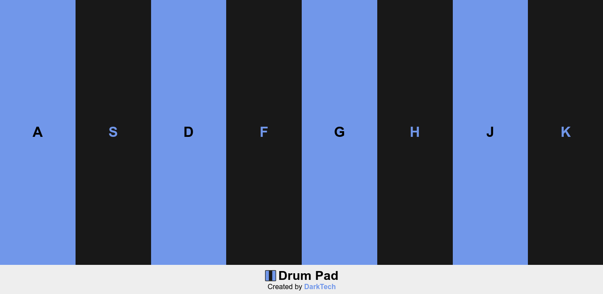

## [DrumPad](https://darktechlc.github.io/drum-pad/)
---
#### Um simples **drum pad** que é ajustado para desktops e dispositivos móveis.

 

##### Versão desktop:

> Na versão desktop, é possível usar tanto o teclado, quanto o clique do mouse.

 

##### Versão mobile:
